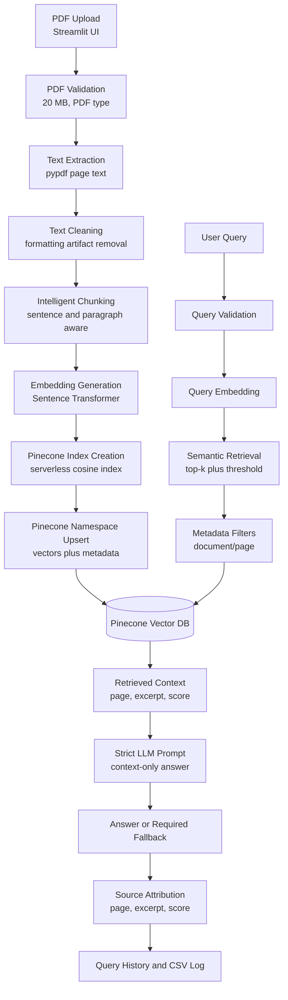

# Architecture Diagram

## Module Responsibilities

| Module | Responsibility |
| --- | --- |
| `app.py` | Streamlit UI, user controls, PDF upload, answer display |
| `src/config.py` | Environment variables and runtime settings |
| `src/pdf_loader.py` | PDF validation and page-level text extraction |
| `src/text_processor.py` | Text cleanup and chunk generation |
| `src/embeddings.py` | Sentence Transformer model loading and embedding generation |
| `src/pinecone_store.py` | Pinecone index creation, namespace upsert, query, metadata filtering |
| `src/retriever.py` | Query embedding, semantic retrieval, threshold filtering |
| `src/generator.py` | Strict context-only LLM answer generation |
| `src/logger.py` | User query logging |
| `src/pipeline.py` | End-to-end orchestration |

## Data Flow

1. The user uploads one or more PDF files through the Streamlit interface.
2. Each PDF is validated for file type, non-empty content, and size up to 20 MB.
3. Text is extracted page by page with `pypdf`.
4. Extracted text is cleaned to remove common PDF line break and spacing artifacts.
5. Text is chunked with page-level traceability.
6. Chunks are embedded with a Sentence Transformer model.
7. The application creates a Pinecone index when necessary with cosine similarity.
8. Chunk vectors are upserted to the selected namespace with metadata.
9. User queries are embedded and searched in Pinecone with top-k retrieval.
10. Optional document and page filters are applied through Pinecone metadata filters.
11. Retrieved chunks below the selected similarity threshold are removed.
12. The LLM receives only the retrieved context and returns a grounded answer or the fallback message.
13. The UI displays the answer and traceable source references.

